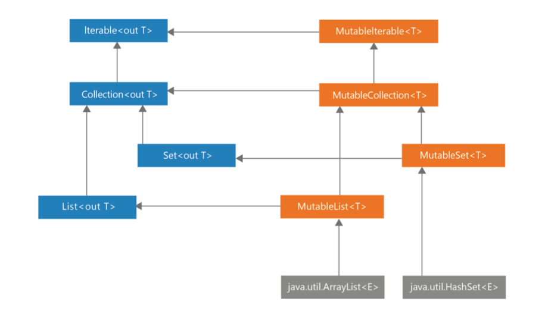

# Item 1 : Limit Mutability

우리는 class, object, function 등의 요소들로 프로그램을 개발합니다. 어떤 요소(element)들은 var 변수를 가지거나 변하는 객체를 가져서 상태를 가질 수 있습니다.

```kotlin
var a = 10
var list: MutablList<Int> = mutableListOf()
```

만약 하나의 element가 상태를 가진다면 이 element의 동작은 사용자가 어떻게 사용하는가 뿐만 아니라 element의 과거에 영향을 받습니다.

```kotlin
class InsufficientFunds: Exception()

class BankAccount {
    var balance = 0.0
        private set

    fun deposit(depositAmount: Double) {
        balance += depositAmount
    }

    @Throws(InsufficientFunds::class)
    fun withdraw(withdrawAmount: Double) {
        if (balance < withdrawAmount) throw InsufficientFunds()
        balance -= withdrawAmount
    }

}

fun main() {
    val account = BankAccount()
    println(account.balance) // 0.0
    account.deposit(100.0)
    println(account.balance) // 100.0
    account.withdraw(50.0)
    println(account.balance) // 50.0
}
```

여기서 BankAccount는 balance라는 var 변수를 통해 현재 계좌 정보 정보 상태를 가지고 있습니다. 상태를 가진다는 것은 양날의 검과 같습니다. 계속 변하는 element를 표현할 수 있는 장점을 가지지만 이는 꽤나 어렵습니다.

1. 변하는 포인트가 많을 수록 프로그램을 이해하고 디버깅하기 어렵습니다. 클래스안에 변하는 점들이 많고 이들이 의존적일 수록 변경하기 어려울 것입니다.
2. Mutability makes it harder to reason about the code?
3. 멀티스레드 환경에서 동기화 작업이 필요합니다.
4. 변하는 element들은 테스트하기 어렵습니다.
5. 상태가 변하면, 다른 클래스들도 이에 대해 영향이 갈 수 있습니다. 예를 들어, 정렬된 리스트에 변경 가능한 element를 삽입하면, 리스트 소팅을 다시해야 할 수 있습니다.

상태 공유가 얼마나 힘든지 한번 살펴봅시다. 아래 예제에서는 여러개의 스레드들이 같은 값을 변경을 시도하려고 합니다.

```kotlin
var num = 0
for (i in 1..1000) {
	thread {
		Thread.sleep(10)
		num += i
	}
}
Thread.sleep(5000)
print(num) // 매번 다른 값
```

코루틴을 사용하면 스레드를 덜 사용하기 때문에 오차가 줄 수 있겠지만, 여전히 에러는 존재합니다.

```kotlin
suspend fun main() {
	var num = 0
	coroutineScope {
		for (i in 1..1000) {
			launch {
				delay(10)
				num += 1
			}
		}
	}
	print(num) // 매번 다른 값
}

```

잘 동작하는 application에서는 올바른 synchronization을 이용해야 합니다.

```kotlin
val lock = Any()
var num = 0
for(i in 1..1000) {
    thread {
        Thread.sleep(10)
        synchronized(lock) {
            num += 1
        }
    }
}
Thread.sleep(1000)
```

이런 작업을 매 바뀌는 점들마다 (Mutating points) 적용하는 것보다는 불변성을 최대한 적용하는 것이 더 좋겠습니다.

### 코틀린에서 변하는 점을 제한하는 방법

여러 가지 방법이 있겠지만 코틀린에서는

- 읽기 전용 변수 val
- mutable & immutable Collections
- 데이터 클래스의 copy

가 중요한 Immutable 포인트입니다.

### 읽기 전용 : val

```kotlin
val a = 10
a = 20 // ERROR
```

A가 읽기 전용이라 해도 A를 불변 혹은 final이라 부를 수 없다. 읽기 전용 (val)은 변경 가능한 객체를 가질 수 있다.

```kotlin
val list = mutableListOf(1, 2, 3)
list.add(4)
println(list) // [1, 2, 3, 4]
```

val로 선언된 변수는 커스텀 게터를 통해 다른 속성에 의해 의존적이게 만들 수 있다.

```kotlin
var name: String = "Marcin"
var surname: String = "Moskala"
val fullName
    get() = "$name $surname"

fun main() {
    println(fullName) // Marcin Moskala
    name = "Maja"
    println(fullName) // Maja Moskala
}
```

이 get() 함수는 fullName에 접근할 때 마다 매번 불려 이렇게 값이 다른 것이다.

```kotlin
fun calculate(): Int {
    println("Calculating..")
    return 42
}

val fizz = calculate()
val buzz
    get() = calculate()

fun main() {        // Calculating..
    println(fizz)   // 42
    println(fizz)   // 42
    println(buzz)   // Calculating.. 42
}
```

그래서 사실상 val은 getter와 동일한 역할을 하고, var은 getter and setter 역할을 하는 것이다. 이런 이유로 우리는 val을 var로 override할 수 있다.

```kotlin
interface Element {
    val active: Boolean
}
class ActualElement: Element {
    override var active: Boolean = false
}
```

val이 포함하는 값은 변경 될 수 있지만, val 변수는 비동기 프로그래밍에 조심해야할 mutation point를 제공하지 않아 더 선호된다.

만약 val을 사용하고 getter를 사용해서 값을 변경 가능하게 하고 싶지 않다면 final 속성을 고려해야한다.

```kotlin
val name: String? = "Marton"
val surname: String = "Braun"
val fullName: String?
    get() = name?.let { "$it $surname" }
val fullName2: String? = name?.let { "$it $surname" }

fun main() {
    if (fullName != null) println(fullName.length) // Error
    if (fullName2 != null) println(fullName2) // Marton Braun
}
```

여기서 fullName에 대한 스마트캐스트는 불가능한데, getter를 사용하여 나중에 변경 가능성이 있기 때문이다. 로컬 속성이 아닌 값들은 final이거나 커스텀 게터가 없어야만 스마트 캐스트가 될 수 있다.

### Mutable & immutable Collections



왼쪽과 오른쪽은 변경 가능한 컬렉션인지에 대해서 나누어진다. 자세히 보면 변경 가능한 (mutable) 인터페이스들은 자기가 해당하는 Read only 인터페이스를 상속한다.

컬렉션도 마찬가지로 read-only 컬렉션은 불변은 아니다. 가끔 변경이 가능하지만, read-only 인터페이스를 상속하기 때문에 변경될 수 없다. 예를 들어, Iterable<T>.map과, Iterable<T>.filter는 변경가능한 ArrayList를 Read only List<T>로 리턴한다. 무슨말이냐면..

```kotlin
inline fun <T, R> Iterable<T>.map(transformation: (T) -> R): List<R> {
    val list = ArrayList<R>()
    for (elem in this) list.add(transformation(elem))
    return list
}
```

이 collection을 100% 변경 불가능으로 만들기 보다 read only로 만든 것을 아는 것이 중요하며, 이는 개발자에게 좀 더 자유를 주는 것을 의미한다. 사실, 인터페이스만 충족한다면 어떤 컬렉션이든 리턴될 수 있다.

여기서 문제가 될 수 있는 점은, 개발자가 down-casting을 시도할 때이다. 코틀린에서는 이와 같은 시도는 절때 이루어지면 안된다. 계약처럼 생각하자!

```kotlin
val list = listOf(1, 2, 3)

// DON'T
if (list is MutableList) list.add(4)
```

이 코드의 결과는 platform-specific하다. JVM listOf는 자바의 List 인터페이스를 구현하는 Arrays.ArrayList를 리턴한다. 자바 리스틑 add,set 같은 경우를 가지기 때문에 MutableList 인터페이스가 될 수 있다. 하지만 Arrays.ArrayList가 이런 메소드를 구현하지 않았기 때문에 아래와 같은 Exception이 일어난다.

```kotlin
Exception in thread "main" java.lang.UnsupportedOperationException
	at java.util.AbstractList.add(AbstractList.java:148)
	at java.util.AbstractList.add(AbstractList.java:108)
```

이래서 코틀린에서는 read-only 컬렉션을 DownCasting해서는 절대 안된다. 만약 mutable 리스트가 필요하다면 아래와 같이 작업하자.

```kotlin
val list = listOf(1, 2, 3)
val mutableList = list.toMutableList()
mutableList.add(4)
```

### 데이터 클래스에서 copy

불변하는 객체들은 map의 키로 써도 무방하다. 이에 비해 변경하는 객체들을 쓰는 것은 위험하다. 보통 Hash Table을 사용하게 되는데, 해시 테이블에 정의 있는 요소들을 변경하면 아마 다시 찾지 못하게 될 것이다. 비슷한 이유로 컬렉션이 소팅될 때 이슈가 있다.

```kotlin
val names: SortedSet<FullName> = TreeSet()
val person = FullName("AAA", "AAA")
names.add(person)
names.add(FullName("Jordan", "Hansen"))
names.add(FullName("David", "Blanc"))

println(names)  // [AAA AAA, David Blanc, Joran Hansen]
print(person in names) // true

person.firstName = "ZZZ"
print(names)  // [ZZZ AAA, David Blanc, Joran Hansen]
print(person in names) // false
```

Set에 있음에도 불구하고 false를 리턴한다. 여기서는 올바르지 않은 위치 때문에 이런 결과가 나타난다.

위에서 볼 수 있듯이, 변경 가능한 객체들은 더 위험하고 예측하기 힘들다. 한 편, 불변 객체의 제일 단점은 데이터가 언젠가는 변경이 필요한 점이다. 여기서의 솔루션은 변경 불가능한 객체가 변경점이 적용된 새로운 객체를 리턴하는 메소드를 가지게 하는 것이다. 예를 들어, Iterable은 read only이기 때문에 map, filters등의 메소드는 Iterable 객체를 변경하지 않고 새로운 객체를 리턴한다.

```kotlin
class User(
    val name: String,
    val surname: String
) {
    fun withSurname(surname: String) = User(name, surname)
}

fun main() {
    var user = User("Maja", "Yong")
    user = user.withSurname("Man")
    println("${user.name}, ${user.surname}") // Maja, Man
}
```

이러한 함수를 매 속성들 마다 구현하는 것이 좀 귀찮긴 하다. 여기서 data class를 사용하면 훨씬 편하다. copy라는 메소드는 새로운 인스턴스를 리턴하되 바꾸고 싶은 필드를 명시할 수 있다.

```kotlin
data class User(
    val name: String,
    val surname: String
)

fun main() {
    var user = User("Maja", "Yong")
    user = user.copy(surname = "Man")
    println("${user.name}, ${user.surname}") // Maja, Man
}
```

### 여러가지 mutation points

Mutable List는 두 가지 방법으로 얻을 수 있다.

- Mutable Collection 사용하기
- Var 사용하기

```kotlin
val list1: MutableList<Int> = mutableListOf()
var list2: List<Int> = listOf()
```

두 개의 변경 방법과 + 연산자 사용법도 다르다

```kotlin
list1.add(1)
list2 = list2 + 1

list1 += 1  // list1.plusAssign(1)
list2 += 1  // list2 = list2.plus(1)
```

```kotlin
var list = listOf<Int>()
for (i in 1..1000) {
    thread {
        list = list + i
    }
}
Thread.sleep(1000)
println(list.size) // 매번 다른값
```

mutable list가 아닌 var을 사용하는 것은 custom setter를 사용했을 때 property가 변경됨을 추적할수 있게 해준다.

```kotlin
var names by observable(listOf<String>()) {
    _, old, new -> println("$old to $new")
}
names += "Fabio" // [] to [Fabio]
names += "Bill" // [Fabio] to [Fabio, Bill]
```

Mutable Collection에 var을 사용함으로 그 변수가 변하는 것을 컨트롤하기 더 쉽니다. 왜냐하면 이 객체를 변하게 하는 것은 setter이기 때문이다. 그래서 아래와 같이 private으로 만들 수 있다.

```kotlin
var announcements = listOf<String>()
    private set
```

mutable colection with val이 좀 더 빠른 옵션이긴 하지만, readonly collection with var이 더

개발자한테 제어권이 있다.

mutable colection with var과 같이 두개다는 사용하지 말자..

```kotlin
// Don't
var list = mutableListOf<String>()
```

동기화를 하는 법을 두 개다 해야하며 plus sign을 쓰는 것이 모호하기 때문에 불가능하다.

### Mutation Point를 노출시키지 마라

상태를 관리하는 Mutable 객체를 노출시키면 더 위험할 수 있다.

```kotlin
data class User(val name: String)
class UserRepository {
    private val storedUsers: MutableMap<Int, String> = mutableMapOf()
    fun loadAll() = storedUsers
}
fun main() {
    val userRepository = UserRepository()
    val storedUsers = userRepository.loadAll()
    storedUsers[4] = "Kirill"
    println(userRepository.loadAll()) //{4=Kirill}
}
```

여기서 두 가지 방법으로 안전하게 만드는 방법이 있다. 첫 번째 방법은 copy본을 리턴하는 것이다. 이를 defensive copying이라 부른다.

```kotlin
class UserHolder {
    private val user: MutableUser()
    fun get(): MutableUser {
        return user.copy()
    }
}
```

Collection의 경우 UpCasting해서 보내는 방법이 있다.

```kotlin
data class User(val name: String)
class UserRepository {
    private val storedUsers: MutableMap<Int, String> = mutableMapOf()
    fun loadAll(): Map<Int, String> = storedUsers
}
```
