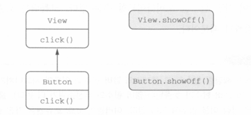

# CH3 : 함수 정의와 호출

## 코틀린 컬렉션

컬렉션은 다양한 방법으로 만들 수 있다.

```kotlin
val set = hashSetOf(1, 7, 35)
val list = arrayListOf(1, 2)
val map = hashMapOf(1 to "one", 7 to "seven")
println(set.javaClass) // class java.util.HashSet
println(list.javaClass) // class java.util.ArrayList
println(map.javaClass) // class java.util.HashMap
```

코틀린은 자신만의 컬렉션 기능을 제공하지 않는다. 이로 인해 자바 코드와 상호작용하기가 훨씬 쉽다. 하지만 자바보다 더 많은 기능을 쓸 수 있다.

```kotlin
val set = hashSetOf(1, 7, 35)
  println(set.last())
  println(set.max())
```

## 함수를 호출하기 쉽게 만들기

자바 컬렉션에는 디폴트 toString이 구현되어 있다. 다른 방식으로 표현하고 싶다면 서드파티 프로젝트를 추가하거나 해야하는데, 코틀린에서는 Extension 기능으로 가능하다.

```kotlin
fun <T> joinToString(
    collection: Collection<T>,
    separator: String,
    prefix: String,
    postfix: String): String {

    val result = StringBuilder(prefix)

    for ((index, element) in collection.withIndex()) {
        if (index > 0) result.append(separator)
        result.append(element)
    }
    result.append(postfix)
    return result.toString()
}
```

자바에서는 이와 비슷하게 새로운 함수를 만들어서 컬렉션을 인자로 넣어주는 형식으로 구현을 해야 할 것이다.

### 이름 붙인 인자

먼저 해당 함수는 가독성의 살짝 문제가 있다.

```kotlin
joinToString(collection, "", "", "")
```

인자로 전달한 각 문자열이 어떤 역할을 하는지 잘 구분이 가지 않는다. 코트린에서는

```kotlin
joinToString(collection, separator = "", prefix = "", postfix = "")
```

이런식으로 처리가 가능하다.

### 디폴트 파라미터 값

코틀린에서는 함수 선언에서 파라미터의 디폴트 값을 지정할 수 있어 오버로딩을 피할 수 있다.

```kotlin
fun <T> joinToString(
    collection: Collection<T>,
    separator: String = "",
    prefix: String = "",
    postfix: String = ""): String {

    val result = StringBuilder(prefix)

    for ((index, element) in collection.withIndex()) {
        if (index > 0) result.append(separator)
        result.append(element)
    }
    result.append(postfix)
    return result.toString()
}
```

자바에서는 디폴트 파라미터 값이라는 개념이 없어서 모든 인자를 명시해야한다. @JvmOverloads 애노테이션을 붙이면 코틀린 컴파일러가 파라미터별 오버로딩 자바 메소드를 추가해준다.

### 정적인 유틸리티 클래스 없애기 : 최상위 함수, 프로퍼티

코틀린에서는 함수나 프로퍼티를 소스 파일의 최상위 수준, 클래스 밖에 위치시켜도 된다. 다른 패키지에서 그 함수를 사용하고 싶을 때 그 함수가 정의된 패키지를 임포트해야한다.

JVM이 클래스 안에 있는 코드만을 실행할 수 있기 때문에 컴파일러는 이 파일을 컴파일할 때 새로운 클래스를 정의해준다. 만약 위의 예제 코드가 join.kt라는 파일에 구현이 되었다면 컴파일 결과를 자바 클래스로 작상해보면

```java
public class JoinKt {
	public static String joinString()
}
```

코틀린 컴파일러가 생성하는 클래스의 이름은 코틀린 소스 파일의 이름과 대응한다. 만약 클래스의 이름을 바꾸고 싶다면 @JvmName 애노테이션을 패키지 이름 선언 전에 추가해야한다

```java
@file:JvmName("Hi")

package strings
fun joinToString(){}

........ JAVA

import strings.Hi
Hi.joinToString(()

```

함수와 마찬가지로 프로퍼티도 파일의 최상위 수준에 놓을 수 있다.

```kotlin
val UNIX_LINE_SEP = "\n"
```

최상위 프로퍼티도 접근자 메소드를 통해 자바 코드에 노출된다. 그럼으로 상수는 아니다. 자바의 public static final 필드로 컴파일 하고 싶다면, const 변경자를 추가하면 된다. (원시타입 + string 타입만 가능)

```kotlin
const val UNIX_LINE_SEP = "\n"
// public static final String UNIX_LINE_SEP = "\n"
```

## 확장 함수, 프로퍼티

확장 함수는 어떤 클래스의 멤버 메소드인 것처럼 호출할 수 있지만 그 클래스 밖에 선언된 함수다.

```kotlin
package strings

fun String.lastChar(): Char = this.get(this.length - 1)
```

클래스의 이름을 receiver type이라 부르며, 확장 함수가 호출되는 대상이 되는 값을 receiver object라 부른다. 여기서는 String이 Receiver type, this가 receiver object이다.

```kotlin
println("Kotlin".lastChar())
```

확장 함수 본문에서도 this를 쓸 수 있으며, 다른 메소드와 마찬가지로 생략 가능하다

```kotlin
fun String.lastChar(): Char = get(length - 1)
```

확장함수 내부에서는 인스턴스 메소드의 내부에서와 마찬가지로 수신 객체의 메소드나 프로퍼티를 바로 사용할 수 있다. 하지만 확장 함수가 캡슐화를 깨지 않는다. 즉 private, protected 메소드를 사용할 수 없다.

### 임포트와 확장 함수

확장 함수를 사용하기 위해서는 그 함수를 다른 클래스나 함수와 마찬가지로 임포트해야한다.

```kotlin
import strings.lastChar
val c = "Kotlin".lastChar()
```

### 자바에서 확장 함수 호출

내부적으로 확장 함수는 수신 객체를 첫 번째 인자로 받는 정적 메소드이다. 그래서 확장 함수를 호출해도 다른 어댑터 객체나 런타임 비용이 들지 않는다. 단지 static 메소드를 호출하면서, 첫 번째 인자로 수신 객체를 넘기기만 하면 된다.

```kotlin
char c = StringUtilKt.lastChar("Java")
```

### 확장 함수로 유틸리티 함수 정의

```kotlin
fun <T> Collection<T>.joinToString(
    separator: String = ", ",
    prefix: String = "",
    postfix: String = ""): String {

    val result = StringBuilder(prefix)

    for ((index, element) in this.withIndex()) {
        if (index > 0) result.append(separator)
        result.append(element)
    }
    result.append(postfix)
    return result.toString()
}

val list = listOf(1, 2, 3)
println(list.joinToString("; ", "(", ")"))
```

확장 함수는 단지 정적 메소드 호출에 대한 syntatic sugar일 뿐이다. 그래서 클래스가 아닌 더 구체적인 타입을 수신 객체 타입으로 지정할 수 있다.

```kotlin
fun  Collection<String>.join(
  separator: String = ", ",
  prefix: String = "",
  postfix: String = "") = joinToString(separator, prefix, postfix)
```

또한 정적 메소드와 같은 특지을 가지므로, 하위 클래스에서 오버라이드 할 수는 없다.

### 확장 함수는 오버라이드 할 수 없다.

```kotlin
open class View {
    open fun click() = println("view clicked")
}
class Button: View() {
    override fun click() = println("Button clicked")
}
fun main() {
    val view: View = Button()
    view.click()
}
```

여기서는 Button 클래스가 오버라이드를 했음으로 button의 click이 호출된다. 하지만 확장은 이런 식으로 작동하지 않는다. 확장 함수는 클래스의 일부가 아니다. 확장 함수는 클래스 밖에 선언된다. 이름과 파라미터가 완전히 같은 확장 함수를 부모 클래스, 자식 클래스에 대해 정의해도 실제로는 확장 함수를 호출할 때 수신 객체로 지정한 변수의 정적 타입에 의해 어떤 확장 함수가 호출될지 결정되고, 객체의 동적인 타입에 의해 확장 함수가 결정되지 않는다.



```kotlin
fun View.showOff() = println("i am view")
fun Button.showOff() = println("I am Button")

fun main() {
    val view: View = Button()
    view.showOff() // i am view
}
```

view가 가리키는 객체의 실제 타입은 Button이지만, 이 경우 view의 타입이 View이기 때문에 무조건 View의 확장 함수가 호출된다.

확장 함수가 첫 번째 인자가 수시 객체인 static java 메소드로 컴파일한다는 사실을 기억하면 이해가 쉽다.

```java
View view = new Button();
ExtensionKt.showOff(view); // I am view
```

만약 확장한 함수를 멤버 함수의 이름과 시그니처를 동일하게 작성했다면 멤버 함수가 호출된다.

### 확장 프로퍼티

프로퍼티라는 이름으로 불리지만 상태를 저장할 적절한 방법이 없기 때문에 ( 기존 클래스의 인스턴스 객체에 필드할 추가할 방법 X) 실제로 아무 상태도 가질 수 없다. 하지만 더 짧게 코드를 작성할 수 있어서 편한 경우가 있다.

```java
var String.lastChar: Char
	= get() = get(length - 1)
```

일반적인 프로퍼티에 단지 수신 객체 클래스가 추가돼었을 뿐이다. 뒷받침하는 필드가 업성서 기본 게터 구현을 제공할 수 없음으로 최소 게터 정의가 필요하다. 마찬가지로 초기화 코드에서 계산한 값을 담을 장소가 없음으로 초기화 코드도 쓸 수 없다.

```kotlin
var StringBuilder.lastChar: Char
  get() = get(length -1)
  set(value: Char) {
      this.setCharAt(length - 1, value)
  }

println("Kotlin".lastChar) // n
val sb = StringBuilder("Kotlin?")
sb.lastChar = '!'
println(sb) // Kotlin!
```

## 컬렉션 처리

### 자바 컬렉션 API 확장

코틀린 컬렉션은 자바와 같은 클래스를 사용하지만 더 확장된 API를 제공한다.

### 가변 인자 함수

리스트를 생성하는 함수를 호출할 때 원하는 만큼 원소를 전달할 수 있다.

```kotlin
public fun <T> listOf(vararg elements: T): List<T>
```

라이브러리를 보면 이 함수의 정의는

```kotlin
public fun <T> listOf(vararg elements: T): List<T>
```

가변 길이 인자는 메소드를 호출할 때 원하는 개수만큼 값을 인자로 넘기면 자바 컴파일러가 배열에 그 값들을 넣어주는 기능이다. 코틀린의 가변 길이 인자도 자바와 비슷하다. 다만 문법이 조금 다른데 타입 뒤에 ... 대신 파라미터 앞에 vararg 변경자를 붙인다.

이미 배열에 들어잇는 원소를 가변 길이 인자로 넘길 때도 다른데, 자바에서는 배열을 그냥 넘기면 되지만 코틀린에서는 배열을 명시적으로 풀어서 배열의 각 원소가 인자로 전달되게 해야 한다. 이를 스프레드 연산(\*)가 그런 작업을 해준다.

```kotlin
fun main(args: Array<String>) {
    val list = listOf("args : ", *args)
    println(list)
}
```

### 값의 쌍 다루기

```kotlin
val map = mapOf(
      1 to "one",
      7 to "seven"
  )
```

여기서 to라는 단어는 코틀린 키워드가 아니다. 이 코드는 중위 호출이라는 특별한 방식으로 to라는 메소드를 호출한 것이다.

중위 호출 시에는 수신 객체와 유이한 메소드 인자 사이에 메소드 이름을 넣는다. 그래서 아래 호출은 동일하다

```kotlin
1.to("one")
1 to "one"
```

인자가 하나뿐인 일반 메소드나 인자가 하나뿐인 확장 함수에 중위 호출을 사용할 수 있다. 함수를 중위 호출에 사용하게 허용하고 싶으면 infix 변경자를 함수 선언 앞에 추가해야 한다.

```kotlin
public infix fun <A, B> A.to(that: B): Pair<A, B> = Pair(this, that)
```

to 함수는 Pair 인스턴스를 반환한다. Pair의 내용으로 두 변수를 즉시 초기화 할 수 있다.

```kotlin
val (number, name) = 1 to "one"
```

이런 기능을 deconstruturing declaration이라 부른다. 이런 기능은 다른 객체에도 적용할 수 있다. withIndex를 통한 루프에서도 구조 분해 선언이 활용된다.

```kotlin
for ((index, element) in collection.wihIndex()) println("$index $elment")
```

to 함수는 확장함수다. to를 사용하면 타입과 관계없이 임의의 순서쌍을 만들 수 있으며 이는 to의 수신 객체가 제너릭하다는 뜻이다.
