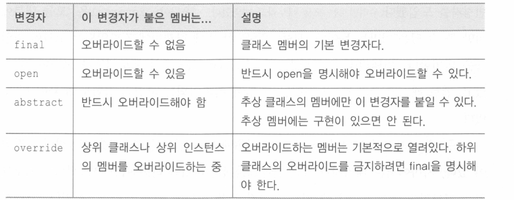
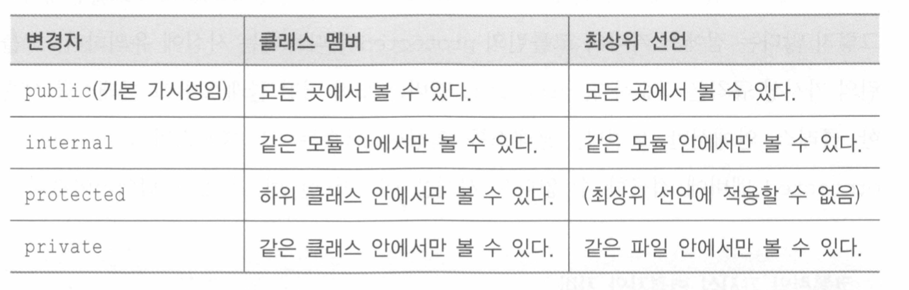
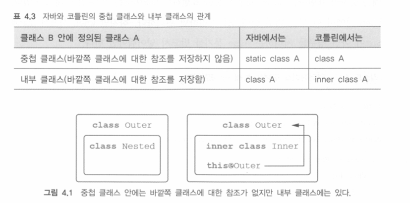
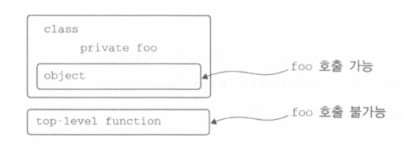

# CH4: 클래스, 객체, 인터페이스

## 클래스 계층 정의

### 코틀린 인터페이스

코틀린 인터페이스는 자바 8 인터페이스와 비슷하다. 추상 메소드뿐 아니라 구현이 있는 메소드도 정의할 수 있다. 하지만 아무런 상태도 들어갈 수 없다.

```kotlin
interface Clickable {
    fun click()
}

class Button: Clickable {
    override fun click() = println("I was clicked")
}
```

인터페이스는 원하는 만큼 구현할 수 있지만 상속은 하나만 된다.

인퍼에스 메소드도 디폴트 구현을 제공할 수 있다.

```kotlin
interface Clickable {
    fun click()
		fun showOff() = println("I am clickable!")
}
```

이 인터페이스를 구현하는 클래스는 click에 대한 구현을 제공해야하지만 showOff에 대해서는 안해도 된다.

```kotlin
interface Focusable {
    fun setFocus(b: Boolean) = println("I got focus")
    fun showOff() = println("I am focusable!")
}
```

만약 Button이 두 개의 인터페이스를 구현한다하면, 디폴트 메소드가 있음에도 불구하고 showOff를 오버라이드해야한다.

```kotlin
class Button: Clickable, Focusable {
    override fun click() = println("I was clicked")
    override fun showOff() {
        super<Clickable>.showOff()
        super<Focusable>.showOff()
    }
}
```

코틀린은 자바 6 즉 인터페이스의 디폴트 메소드를 지원하지 않는 버전과 호완된다. 코틀린은 해당 인터페이스를 일반 인터페이스와 디폴트 메소드 구현이 정적 메소드로 들어있는 클래스를 조합해 구현한다. 그래서 자바에서는 이런 인터페이스를 구현하고 싶으면 코틀린에서 메소드 본문을 제공하는 메소드를 포함하는 모든 메소드에 대한 본문을 작성해야 한다.

### open, final, abstract

코틀린의 클래스와 메소드는 기본적으로 final이다. 상속을 허용하려면 open 변경자를 붙여야 한다. 더불어 오버라이드를 허용하고 싶은 메소드나 프로퍼티 앞에도 open 변경자를 붙여야한다.

```kotlin
open class RichButton: Clickable {
	fun disable() {}
	open fun animate() {}
	override fun click() {}
}
```

오버라이드한 함수는 Open인데 final을 붙여 막을 수 있다. 클래스의 기본적인 상속 가능 상태를 final로 함으로 스마트 캐스트가 가능하다. 스마트캐스트는 타입 검사 뒤에 변경될 수 업슨 변수에만 적용 가능하다. 클래스 프로퍼티의 경우 val이면서 커스텀 접근자가 없는 경우에만 스마트 캐스트를 쓸 수 있는 의미이다. 프로퍼티가 final이 아니라면 그 프로퍼티를 다른 클래스가 상속하면서 커스텀 접근자를 정의함으로써 스마트 캐스트의 요구 사항을 갤 수 있다.

추상 클래스는 abstract로 선언할 수 있으며 open 변경자를 명시할 필요가 없다

```kotlin
abstract class Animated {
    abstract fun animate()
    open fun stopAnimating() {}
    fun animateTwice() {}
}
```

추상 클래스에 속했더라도 비추상 함수는 기본적으로 파이널이지만 원한다면 open으로 오버라이드를 허용할 수 있다.



### 가시성 변경자

가시성 변경자는 클래스 외부 접근을 제어한다. 기본적으로 자바와 비슷하지만 코틀린의 기본 가시성은 자바와 다르다. 아무 변경자가 없는 선언은 모두 public이다.

즉 자바의 기본 가시성인 패키지 전용은 코트린에 없다.

패키지 전용 가시성에 대한 대안으로 코틀린에는 internal이라는 새로운 가시성 변경자를 도입했다. 이는 모듈 내부에서만 볼수 있음을 뜻하며, 모듈은 한꺼번에 컴파일되는 코틀린 파일을 의미한다.

또 다른 차이는 코틀린에서는 최상위 선언에 대해 private을 허용한다. 비공개 최상위 선언은 해당 파일 내부에서만 사용할 수 있다.



```kotlin
internal open class TalkativeButton: Focusable {
    private fun yell() = println("Hey")
    protected fun whisper() = println("Lets talk")
}
fun TalkativeButton.giveSpeech() {
    yell() // private
    whisper() // protected
}
```

코틀린은 public 함수인 giveSpeech 안에서 그보다 가시성이 더 낮은 internal 타입인 TalkativeButton을 참조하지 못하게 한다. 여기서 컴파일 오류를 없애려면 giveSpeech 확장 함수의 가시성을 internal로 바꾸거나 TalkativeButton 클래스의 가시성을 Public으로 바꿔야한다.

자바에서는 같은 패키지 안에서 protected를 접근할 수 있지만 코틀린에서는 불가능하다. protected 멤버는 오직 어떤 클래스나, 그 클래스를 상속한 클래스 안에서만 보인다. 확장 함수는 즉, private, protected 멤버에 접근이 불가능하다.

코틀린 가시성은 자바 바이트코드으로 동일하지만 private 클래스만 예외이다. 자바에서는 클래스를 private으로 만들 수 없음으로 내부적으로 코틀린은 private 클래스를 패키지-전용 클래스로 컴파일 한다.

internal같은 경우 바이트코드상에서는 Public이다. 이런 경우 때문에 자바에서 접근하면 안되는 대상을 접근할 수 있는 경우가 생긴다. 하지만 코틀린 컴파일러는 internal 멤버의 이름을 보기 바꾼다는 사실을 기억하자.(사용도 못하게끔)

또 다른 차이점은 코틀린에서는 외부 클래스가 내부 클래스나 중첩 크래스의 private 멤버에 접근할 수 없다.

### 내부 클래스와 중첩 클래스

코틀린도 클래스 안에 다른 클래스를 선언할 수 있다. 클래스 안에 다른 클래스를 선언하면 도우미 클래스를 캡슐화하거나 코드 정의를 그 코드를 사용하는 곳 가까이에 두고 싶을 때 유용하다. 자바와의 차이는 코틀린의 중첩 클래스는 바깥쪽 클래스 인스턴에 대한 접근 권한이 없다.

```kotlin
interface State: Serializable

interface View {
    fun getCurrentState(): State
    fun restoreState(state: State) {}
}
```

보통 클래스의 상태를 저장하는 클래스는 Button 클래스 내부에 선언하면 편하다. 자바에서는

```kotlin
public class Button implements View {
	@Override
	public State getCurrentState() {
		return new ButtonState();
	}
	@Override
	public void restoreState(State state) {}
	public class ButtonState implements State {}
}
```

이런식으로 State 인터페이스를 구현한 ButtonState 클래스를 정의해서 Button에 대한 구체적인 정보를 저장할 수 있다. 하지만 이런식으로 하면 에러가나는데 자바에서는 다른 클래스 안에 정의한 클래스는 자동으로 내부 클래스가 된다. 해당 예제의 ButtonState 클래스는 바깥쪽 Button 클래스에 대한 참조를 묵시적으로 포함한다. 그 참조로 인해 ButtonState를 직렬화할 수 없다. Button은 Serializable이 되지 않기 때문에, ButtonState의 직렬화가 불가능하다.

이런 문제를 해결하려면 ButtonState를 static 클래스로 선언해서 그 클래스를 둘러싼 바깥쪽 클래스에 대한 묵시적인 참조를 사라지게 해야한다.

코틀린은 중첩 클래스가 정반대로 작동한다.

```kotlin
class Button: View {
    class ButtonState: State {}
    override fun getCurrentState(): State = ButtonState()
    override fun restoreState(state: State) {}
}
```

코틀린 중첩 클래스에 아무런 변경자가 붙지 않으면 자바의 static 중첩 클래스와 같다. 이를 내부 클래스로 변경해서 바깥쪽 클래스에 대한 참조를 포함하게 만들고 싶다면 inner 변경자를 붙여야 한다.



또한 바깥쪽 클래스의 인스턴스를 가리키는 참조를 표기하려면 this@Outer라고 써야 접근할 수 있다.

```kotlin
class Outer {
    inner class Inner {
        fun getOuterReference(): Outer = this@Outer
    }
}
```

### 봉인된 클래스

```kotlin
interface Expr
class Num(val value: Int): Expr
class Sum(val left: Expr, val right: Expr): Expr

fun eval(e: Expr): Int =
    when(e) {
        is Num -> e.value
        is Sum -> eval(e.left) + eval(e.right)
        else -> throw IllegalArgumentException("no")
    }
```

보시다 싶히 컴파일러는 when 식에서 Num, Sum이 아닌 경우를 처리하는 else 분기를 강제한다. 항상 디폴트 분기를 추가하는게 편하지 않고 실수가 있을 수 있다.

이런 문제에 대한 해법은 sealed 클래스이다. 상위 클래스에 sealed 변경자를 붙이면 그 상위 클래스를 상속한 하위 클래스 정의를 제한할 수 있다. sealed 클래스의 하위 클래스를 정의할 때는 반드시 상위 클래스 안에 중첩시켜야 한다.

```kotlin
sealed class Expr {
    class Num(val value: Int): Expr()
    class Sum(val left: Expr, val right: Expr): Expr()
}

fun eval(e: Expr): Int =
    when(e) {
        is Expr.Num -> e.value
        is Expr.Sum -> eval(e.left) + eval(e.right)
    }
```

이런식으로 하면 when 식에서 else 분기가 필요없다. seaeld로 표시된 클래스는 자동으로 open이 되지만 외부에서는 상속이 불가능하다.

내부적으로 Expr 클래스는 private 생성자를 가지고 클래스 내부에서만 호출할 수 있다. sealed interface는 정의가 불가능한데, 봉인된 인터페이슬ㄹ 만들 수 있다면 그 인터페이스를 자바 쪽에서 구현하지 못하게 막을 수 있는 수단이 없기 때문이다.

## 뻔하지 않은 생성자와 프로퍼티를 가진 클래스

코틀린에서는 주 생성자와 부 생성자를 구분한다. 또 초기화 블록을 통해 초기화 로직을 추가할 수 있다.

### 주 생성자와 초기화 블록

```kotlin
class User(val nickname: String)
```

이 클래스 선언에는 중괄호가 없고 괄호 사이에 val 선언만 존재한다. 이렇게 클래스 이름 뒤에 오는 괄호로 둘러싸인 코드를 주 생성자라 부른다. 주 생성자는 생성자 파라미터를 지정하고, 그에 의해 초기화되는 프로퍼티를 정의하는 두 가지 목적으로 쓰인다. 실제로 같은 목적을 할 수 있는 가장 명시적인 선언은

```kotlin
class User constructor(_nickname: String) {
    val nickname: String
    init {
        nickname = _nickname
    }
}
```

constructor 키워드는 주 생성자나 부 생성자 정의를 시작할 때 사용한다. init 키워드는 초기화 블록을 시작한다.

파라미터 *nickname의 *는 프로퍼티와 생성자 파라미터를 구분해준다. 아래와 같이 작성해도 괜찮다.

```kotlin
class User constructor(_nickname: String) {
    val nickname: String = _nickname
}
```

프로퍼티를 초기화는 식이나 초기화 블록안에서만 주 생성자의 파라미터를 참조할 수 있다.

주 생성자의 파라미터로 프로퍼티를 초기화한다면 그 주 생성자 파라미터 이름 앞에 val을 추가하는 방식으로 프로퍼티 정의와 초기화를 간략할 수 있다.

```kotlin
class User(val nickname: String)
```

모든 생성자 파라미터에 디폴트 값을 지정하면 컴파일러가 자동으로 파라미터가 없는 생성자를 만들어준다. 그렇게 자동으로 만들어진 파라미터 없는 생성자는 디폴트 값을 사용해 클래스를 초기화 한다.

클래스에 부모 클래스가 있다면 주 생성자에서 기반 클래스의 생성자를 호출해야 할 필요가 있다.

```kotlin
open class User(val nickname: String)
class TwitterUser(nickname: String): User(nickname)
```

별도로 생성자를 정의하지 않으면 컴파일러가 디폴트 생성자를 만들어 준다.

```kotlin
open class Button
class RadioButton: Button()
```

어떤 클래스를 인스턴스화하지 못하게 막고 싶다면 모든 생성자를 private으로 만들면 된다.

### 부 생성자: 상위 클래스를 다른 방식으로 초기화

```kotlin
open class View {
    constructor(ctx: Context) {}
    constructor(ctx: Context, attr: AttributeSet) {}
}
```

이 클래스는 주 생성자를 선언하지 않고, 부 생성자만 2가지 선언한다. 부 생성자는 constructor 키워드로 시작한다. 이 클래스를 확장하면서 똑같이 부 생성자를 정의할 수 있다.

```kotlin
class MyButton: View {
    constructor(ctx: Context): super(ctx) {}
    constructor(ctx: Context, attr: AttributeSet): super(ctx, attr) {}
}
```

또한 this()를 통해 다른 생성자 호출이 가능하다.

클래스에 주 생성자가 없다면 모든 부 생성자는 반드시 상위 클래스를 초기화하거나 다른 생성자에게 생성을 위임해야한다.

### 인터페이스에 선언된 프로퍼티 구현

인터페이스에 추상 프로퍼티 선언이 가능하다.

```kotlin
interface User {
    val nickname: String
}
class PrivateUser(override val nickname: String): User
class SubscribingUser(val email: String): User {
    override val nickname: String
        get() = email.substringBefore('@')
}
class FacebookUser(val accountId: Int): User {
    override val nickname: String = getFacebookName(accountId)
}
```

위에 세가지 클래스는 각자 다른 방법으로 nickname을 구현한다. PrivateUser는 주 생성자 안에 프로퍼티를 직접 선언한다.

SubscribingUser는 커스텀 게터로 nickname 프로퍼티를 설정한다.

FacebookUser에서는 초기화 식으로 nickname 값을 초기화 한다. SubscribingUser와 FacebookUser의 구현 차이는 SubscribingUser의 nickname은 매번 호출 될 때마다 계산이 된다.

인터페이스에는 추상 프로퍼티뿐만 아니라 게터와 세터가 있는 프로퍼티를 선언할 수 있다. 물론 이들은 뒷받침하는 필드를 참조할 수 없다.

```kotlin
interface User {
    val email: String
    val nickname: String
        get() = email.substringBefore('@')
}
```

하위 클래스는 nickname을 오버라이드 하지 않는다.

### 게터와 세터에서 뒷받침하는 필드에 접근

값을 저장하는 동시에 로직을 실행할 수 있게 하기 위해서는 접근자 안에서 프로퍼티를 뒷받침하는 필드에 접근할 수 있어야 한다.

```kotlin
class User(val name: String) {
    var address: String = "unspecified"
        set(value: String) {
            println("$field -> $value")
            field = value
        }
}

val user = User("Alice")
user.address = "oh no" //unspecified -> oh no
```

코틀린에서 프로퍼티의 값을 바꿀때는 user.address = "new value"처럼 사용한다. 이는 내부적으로 address의 세터를 호출한다.

### 접근자의 가시성 변경

접근자의 가시성은 기본적으로는 프로퍼티의 가시성과 같다. 하지만 원한다면 get이나 set앞에 가시성 변경자를 추가할 수 있다.

```kotlin
class LengthCounter {
    var count: Int = 0
        private set
    fun addWord(word: String) {
        count += word.length
    }
}

val lc = LengthCounter()
lc.addWord("Hi!")
println(lc.counter) // 3
```

## 데이터 클래스, 클래스 위임

### 클래스 위임 : by 키워드

대규모 객체지향 시스템에서는 보통 구현 상속에 의해 문제가 발생한다. 하위 클래스가 상위 클래스의 메소드 중 일부를 오버라이드 하면 하위 클래스는 상위 클래스의 세부 구현 사항에 의존하게 된다. 도중 상위 클래스의 구현이 바껴서 하위 클래스와 하위 호완이 깨질 수 있다.

코틀린에서는 기본적으로 final이다. 하지만 종종 상속을 허용하지 않는 클래스에 새로운 동작을 추가해야 할 대가 있다. 이럴 때 사용하는 방법이 Decorator 패턴이다. 상속을 허용하지 않는 클래스 대신 사용할 수 있는 새로운 클래스를 만들되 기존 클래스와 같은 인터페이스를 데코레이터가 제공하게 만들고, 기존 클래스를 데코레이터 내부에 필드로 유지한느 것이다. 새로 정의해야 하는 기능은 데코레이터 메소드에 정의하면 되는 것이다.

이는 코드가 상당히 많이 필요하다.

```kotlin
class DelegatingCollection<T>: Collection<T> {
    private val innerList = arrayListOf<T>()
    override val size: Int
        get() = innerList.size

    override fun contains(element: T): Boolean = innerList.contains(element)

    override fun containsAll(elements: Collection<T>): Boolean = innerList.containsAll(elements)

    override fun isEmpty(): Boolean = innerList.isEmpty()

    override fun iterator(): Iterator<T> = innerList.iterator()
}
```

이런 위임을 코틀린에서 인터페이스를 구현할 때 by 키워드를 통해 그 인터페이스에 대한 구현을 다른 객체에 위임 중이라는 사실을 명시할 수 있다.

```kotlin
class DelegatingCollection<T>(innerList: Collection<T> = ArrayList<T>()):
    Collection<T> by innerList {
}
```

메소드 중 일부의 동작을 변경 하고 싶은 경우 메소드를 오버라이드 하면 컴파일러가 생성한 메소드 대신 오버라이드한 메소드가 쓰인다.

```kotlin
class CountingSet<T>(
    val innerSet: MutableCollection<T> = HashSet<T>()
): MutableCollection<T> by innerSet {

    var objectsAdded = 0

    override fun add(element: T): Boolean {
        objectsAdded++
        return innerSet.add(element)
    }

    override fun addAll(elements: Collection<T>): Boolean {
        objectsAdded += elements.size
        return innerSet.addAll(elements)
    }
}
```

## Object

### 싱글톤

Object는 클래스 선언과 그 클래스에 속한 단일 인스턴스의 선을 합친 선언이다.

```kotlin
object Payroll {
    val allEmployees = arrayListOf<Person>()

    fun calculateSalary() {
        for(person in allEmployees) {

        }
    }
}
```

객체 선언은 클래스를 정의하고 그 클래스의 인스턴스를 만들어서 변수에 저장하는 모든 작업을 단 한 문장으로 처리한다. 생성자는 객체 선언에 쓸 수 없고 객체 선언문이 있는 위치에서 생성자 없이 즉시 만들어진다. 또한 클래스나 인터페이스를 상속할 수 있다.

```kotlin
object CaseInsensitiveFileComparator: Comparator<File> {
    override fun compare(o1: File, o2: File): Int {
        return o1.path.compareTo(o2.path, ignoreCase = true)
    }
}
```

클래스 안에서 객체를 선언할 수 있다.

```kotlin
data class Person(val name: String) {
    object NameComparator: Comparator<Person> {
        override fun compare(o1: Person, o2: Person): Int {
            return o1.name.compareTo(o2.name)
        }
    }
}

fun main(args: Array<String>) {
    val persons = listOf(Person("Bob"), Person("Alice"))
    println(persons.sortedWith(Person.NameComparator))
}
```

코틀린 ojects는 자바 클래스의 정적필드로 컴파일된다. 이 필드의 이름은 항상 INSTANC다.

```kotlin
// JAVA
CaseInsensitiveFileComparator.INSTANCE.compare(file1, file2)
```

### 동반 객체

코틀린에서는 static 키워드를 최상위 함수와 object 키워드를 활용한다. 대부분의 경우 최상위 함수를 활용하는 편이 더 권장된다.



하지만 함수는 private으로 표시된 크래스 비공개 멤버에 접근할 수 없지만 companion object는 가능하다. companion이라는 특별한 표시를 붙이면 동반 객체로 만들수 있다. 이로써 자바의 정적 메소드 호출이나 정적 필드 사용 구문이 같아진다.

```kotlin
class A {
    companion object {
        fun bar() {
            println("Companion object called")
        }
    }
}
```

동반 객체는 자기 클래스의 Private 멤버에 접근할 수 고 private 생성자도 호출할 수 있다.

```kotlin
class User {
    val nickname: String

    constructor(email: String) {
        nickname = email.substringBefore('@')
    }
}
```

이런 코드를

```kotlin
class User private constructor(val nickname: String) {
    companion object {
        fun newSubscribingUser(email: String) = User(email.substringBefore('@'))
    }
}
fun main(args: Array<String>) {
    val user = User.newSubscribingUser("bob@gmail.com")
    println(user.nickname)
}
```

이 예제처럼 팩토리 메소드를 목적에 따라 이름을 정할 수 있다. 게다가 팩토리 메소드는 클래스의 하부 객체를 반환할 수도 있고, 캐시같은것을 이용해 기존 인스턴스를 반환할 수 있다.

### 동반 객체를 일반 객체처럼 사용

동반객체는 클래스 안에 저의된 일반 객체다. 이름을 붙이거나, 인터페이스를 상속하거나, 확장 함수와 프로퍼티를 정의할 수 있다.

```kotlin
data class Person(val name: String) {
    companion object Loader {
        fun fromJson(jsonText: String): Person = {}
    }
}

person = Person.Loader.fromJson("{name:'s'}")
```

특별한 이름을 지정하지 않으면 객체 이름은 자동으로 Companion이 된다.

또한 인터페이스를 구현할 수 있다.

```kotlin
interface JSONFactory<T> {
    fun fromJSON(jsonText: String): T
}

class Person(val name: String) {
    companion object: JSONFactory<Person> {
        override fun fromJSON(jsonText: String): Person = TODO()
    }
}
```

이제 JSON으로 부터 각 원소를 다시 만들어내는 추상 팩토리가 있다면 Person 객체를 그 팩토리에게 넘길 수 있다.

```kotlin
fun loadFromJSON<T>(factory: JSONFactory<T>): T {
}
loadFromJSON(Person)
```

동반 객체는 클래스에 정의된 인스턴스를 가리키는 정적 필드로 컴파일되며 이름을 붙이지 않으면 Companion이라는 이름으로 참조에 접근 가능하다.

자바에서 사용하기 위해 코틀린 클래스의 멤버를 정적인 멤버로 만들어야 할 필요가 있을 때 @JvmStaic 애노테이션을 붙이면 된다.

클래스에 동반 객체가 있으면 그 객체 안에 함수를 정의해서 클래스에 대해 호출할 수 있는 확장 함수를 만들 수 있다. 예를 들어 C라는 클래스에 동반 객체가 있고, 객체 안에 func 메소드를 정의하면 C.func()로 접근가능하다.

```kotlin
class Person(val firstName: String, val lastName: String) {
    companion object {}
}
fun Person.Companion.fromJSON(json: String): Person {

}
val p = Person.fromJSON(json)
```

이는확장 함수라 실제로는 멤버 함수가 아니다 이런식으로 동반객체 확장 함수를 정의하려면 꼭 동반 객체가 필요하다.

### 객체 식

무명 객체를 정의할 때도 object가 쓰인다. 무명 객체는 자바의 무명 내부 클래스를 대신한다.

```kotlin
window.addMouseistener {
	object: MouseAdapater() {
		override fun mouseClicked(e: MouseEvent) {
		}
		override fun mouseEntered(e: MouseEvent) {
		}
	}
}
```

여기서는 이름이 빠졌다. 객체 식은 클래스를 정의하고 그 클래스에 속한 인스턴스를 생성하지만, 그 클래스나 인스턴스에 이름을 붙이지는 않는다. 이름을 붙여한다면 변수에 객체를 대입하면 된다.

```kotlin
window.addMouseistener {
	val listener = object: MouseAdapater() {
		override fun mouseClicked(e: MouseEvent) {
		}
		override fun mouseEntered(e: MouseEvent) {
		}
	}
}
```

한 인터페이스만 구현하거나 한 클래스만 확장할 수 있는 자바의 무명 내부 클래스와 다리 코틀린 무명 클래스는 여러 인터페이스를 구현하거나 클래스를 확장하면서 인터페이스를 구현할 수 있다.

자바와 달리 객체 식 안의 코드는 그 식이 포함된 함수의 변수에 접근할 수 있다. 자바와 달리 final이 아닌 변수도 객체 식 안에서 사용될 수 있고 변수의 값을 변경할 수 있다.

```kotlin
fun countClicks(window: Window) {
	var count = 0
	window.addMousListener(object: MouseAdapter() {
		override fun mouseClicked(e: MouseEvent) {
			count++
		}
	}
}
```
