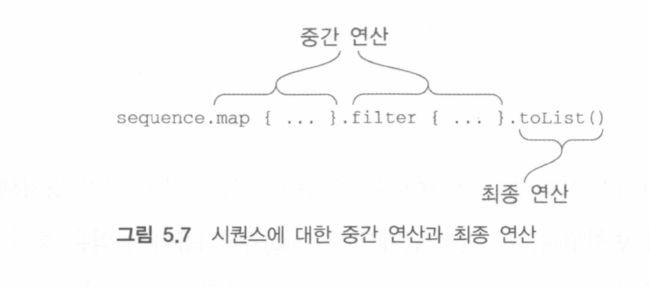
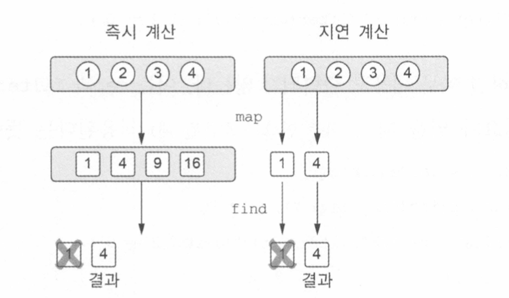

# CH5: 람다

## 람다 식과 멤버 참조

### 람다와 컬렉션

```kotlin
data class Person(val name: String, val age: Int)

fun findTheOldest(people: List<Person>) {
    var maxAge = 0
    var theOldest: Person? = null
    for (person in people) {
        if(person.age > maxAge) {
            maxAge = person.age
            theOldest = person
        }
    }
    println(theOldest)
}
```

이 코드에서 루프에는 코드가 많이 있기 때문에 실수를 저지르기 쉽다. 코틀린에서는 라이브러리 함수를 쓰면 된다.

```kotlin
val people = listOf(Person("Alice", 29), Person("Bob", 31))
println(people.maxBy {it.age})
```

maxBy는 가장 큰 원소를 찾기 위해 비교에 사용할 값을 돌려주는 함수를 인자로 받는다. 여기서 it.age는 바로 비교에 사용할 값을 돌려주는 함수다. 또 멤버참조로도 대치할 수 있다.

```kotlin
people.maxBy(Person::age)
```

람다는 아래와 같이 실행하는 것이 좋다.

```kotlin
{ println(42) } () // BAD
run { println(42) } // BETTER
```

이런식으로 함수를 괄호를 뺄 수 있다.

```kotlin
println(people.joinToString(separator = " ", transform = { p -> p.name}))
println(people.joinToString(" ") { p -> p.name })
```

람다를 변수에 저장할 때는 파라미터의 타입을 추론할 문맥이 존재하지 않기 때문에 파라미터 타입을 명시해야 한다.

```kotlin
val getAge = { p: Person -> p.age }
```

### 현재 영역에 있는 변수에 접근

자바 메소드 안에서 무명 내부 클래스를 정의할 때 메소드의 로컬 변수를 무명 내부 클래스에서 사용할 수 있다. 람다에서도 가능하며, 함수 안에서 정의하면 파라미터뿐만 아니라 로컬 변수까지 사용 가능하다.

```kotlin
fun printMsgWithPrefix(msgs: Collection<String>, prefix: String) {
    msgs.forEach { println("$prefix $it")}
}

fun main(args: Array<String>) {
    val errors = listOf("403 Forbidden", "404 Not Found")
    printMsgWithPrefix(errors, "Error:")
}
```

자바와 다른 점 중 하나는 코틀린 람다 안에서는 파이널 변수가 아닌 변수에 접근할 수 있다.

```kotlin
fun printProblemCounts(responses: Collection<String>) {
    var clientErrs = 0
    var serverErrs = 0
    responses.forEach {
        if(it.startsWith("4")) clientErrs++
        else serverErrs++
    }
    println("$clientErrs, $serverErrs")
}
```

람다에서는 밖에 있는 변수에 접근 및 변경 까지 가능하다. prefix, clientErrs, serverErrs와 같은 외부 변수를 람다가 포획한 변수라고 부른다.

기본적으로 함수 안에 정의된 로컬 변수의 생명주기는 리턴시 끝난다. 하지만 어떤 함수가 자신의 로컬 변수를 포획한 람다를 반환하거나 다른 변수에 저장한다면 로컬 변수의 생명주기와 함수의 생명주기가 달라질 수 있다. 포획한 변수가 있는 람다를 저장해서 함수가 끝난 뒤에도 람다의 본문 코드에는 여전히 포획한 변수를 사용할 수 있다.

파이널 변수를 포획한 경우 람다 코드를 변수 값과 함께 사용하고 아니면 변수를 특별한 래퍼로 감싸서 나중에 변경하거나 읽을 수 있게 한다음, 래퍼에 대한 참조를 람다 코드와 함께 저장한다.

자바에서 파이널 변수만 포획할 수 있지만, 변경 가능한 변수를 저장하나는 단 하나뿐인 배열을 선언하거나, 변경 가능한 변수를 필드로 하는 클래스를 선언해서 속일수 있다. (배열이나 클래스의 인스턴스에 대한 참조를 final로 만들면 포획 가능하다).

```kotlin
class Ref<T>(var value: T)
val counter = Ref(0)
val inc = { counter.value++ }
```

이런식으로 작업할 수 있겠지만 실제로는 이런 래퍼를 안만들어도 된다.

람다를 이벤트 핸드러나 다른 비동기적으로 실행되는 코드로 활용하는 경우 함수 호출이 끝난 다음에 로컬 변수가 변경될 수 있다.

```kotlin
fun tryToCountButtonClicks(button: Button): Int {
    var clicks = 0
    button.onClick { clicks++ }
    return clicks
}
```

이 함수는 0을 항상 반환하는데, onCllick의 핸들러는 호출될 때마다 clicks의 값을 증가시키지만 그 값의 변경을 관찰할 수 없다. clicks를 리턴한 다음 핸들러가 호출되기 때문이다.

### 멤버 참조

넘기려는 코드가 이미 함수로 선언되는 경우를 어떻게 참조할 수 있을까. 자바와 마찬가지로 ::를 사용하면 된다.

```kotlin
val getAge = Person::age
```

::는 멤버 참조라 부른다. 즉 위 코드는 아래 코드와 똑같다.

```kotlin
val getAge = {p -> p.age}
```

최상위 함수같은 경우는 이렇게 하면 된다.

```kotlin
fun salute() = println("hi")
run(::salute)
```

생성자 참조를 사용하면 클래스 생성 작업을 연기하거나 저장해둘 수 있다.

```kotlin
val createPerson = ::Person
  val p = createPerson("Alice", 29)
```

### lazy 컬렉션 연산

map이나 filter 같은 함수는 결과 컬렉션을 즉시 생성한다. 즉 이를 연쇄하면 매 단계마다 계산 중간 결과를 새로운 컬렉션에 임시로 담는다. 시퀀스를 이용하면 좀 더 효율적이게 만들 수 있다.

```kotlin
people.map(Person::name).filter { it.startsWith("A") }
```

map, filter 둘다 리스트를 반환한다. 이는 연쇄 호출이 리스트 2개를 만든다는 것이다.

```kotlin
people.asSequence()
    .map(Person::name)
    .filter { it.startsWith("A") }
    .toList()
```

결과 자체는 같지만, 성능이 좋아진다. Sequence 인터페이스는 단지 한 번에 하나씩 열거될 수 있는 원소의 시퀀스를 표현한다. 안에는 iterator라는 단 하나의 메소드가 있고 그 메소소드를 통해 원소 값을 얻을 수 있다.

장점은 이 인터페이스 위에는 연산이 결과를 저장하지 않고도 연쇄적으로 적용이된다. 시퀀스는 연산을 지연하기 때문에 실행하게하려면 원소를 하나씩 이터레이션하거나 최종 시퀀스를 리스트로 변환해야 한다.

### 시퀀스 연산 실행

시퀀스 연산은 중간, 최종으로 나뉜다. 중간 연산은 다른 시퀀스를 반환한다. 그 시퀀스는 최초 시퀀스의 원소를 변환하는 방법을 안다. 최종 연산은 결과를 반환한다. 결과는 최초 커렉션에 대한 변환을 적용한 시퀀스로부터 계산을 수행해 얻을 수 있는 결과이다.



중간 연산은 항상 지연된다.

```kotlin
listOf(1, 2, 3, 4).asSequence()
    .map{ println("hi"); it * it}
    .filter { println("hello"); it % 2 == 0 }
```

이 코드를 실행하면 아무 내용도 출력되지 않는다.

```kotlin
listOf(1, 2, 3, 4).asSequence()
        .map{ print("map $it "); it * it}
        .filter { println("filter $it "); it % 2 == 0 }
        .toList()

//    map 1 filter 1
//    map 2 filter 4
//    map 3 filter 9
//    map 4 filter 16
```

시퀀스의 경우 각 원소에 대해서 연산이 순서대로 이루어진다. 따라서 원소에 대해서 연산을 차례대로 적용하다가 결과가 얻어지면 그 이후에 원소에 대해서는 연산이 작용하지 않는 것이다.

```kotlin
listOf(1, 2, 3, 4).asSequence()
        .map { it * it }.find { it > 3}
```



### 시퀀스 만들기

시퀀스는 generateSequence함수를 사용해서 만들 수 있다.

```kotlin
val numbers = generateSequence(0){ it + 2 }
val numbersTo100 = numbers.takeWhile { it <= 100}
println(numbersTo100.sum()) // 5050
```

numbers, numbersTo100 모두 시퀀스이며, 연산을 지연 계산한다. 최종 연산을 수행하기 전까지는 시퀀스의 각 숫자는 계산되지 않는다.

시퀀스를 사용하는 사례는 객체의 조상으로 이루어진 시퀀스를 만들어내는 것이다. 어떤 객체의 조상이 자신과 같은 타입이고 모든 조상의 시퀀스에서 어떤 특성을 알고 싶을 때가 있다.

```kotlin
fun File.isInsideHiddenDirectory() =
    generateSequence(this) { it.parentFile }.any {it.isHidden}
```

여기서는 첫 번째 원소를 지정하고, 시퀀스의 한 원소로부터 다음 원소를 계산하는 방법으로 시퀀스를 만든다.

## 자바 함수형 인터페이스 활용

```kotlin
public class Button {
	public void setOnclickListener(onClickListener l) {}

public interface OnClickListener {
	void onClick(View v)
}
```

코틀린에서는 무명 클래스 인스턴스 대신 람다를 넘길 수 있다.

```kotlin
button.setOnClickListener{ view -> }
```

이런 코드가 작동하는 이유는 OnClickListener에 추상 메소드가 단 하나만 있기 때문이다. 이런 인터페이스를 SAM 인터페이스라고 한고 단일 추상 메소드라는 뜻이다. 코틀린은 SAM을 취하는 자바 메소드를 호출할 때 람다를 넘길 수 있게 해준다.

### 자바 메소드에 람다를 전달

SAM 인터페이스를 인자로 원한느 자바 메소드에 코틀린 람다를 전할 수 있다.

```kotlin
// JAVA
void postponeComputation(int delay, Runnable computation);
```

코틀링넹서 람다를 이 함수에 넘길 수 있고, 컴파일러는 자동으로 람다를 Runnable 인스턴스로 반환해준다.

```kotlin
postponeComputation(1000) { println(42) }
```

Runnable 인스턴스라는 실제로는 Runnable을 구현한 무명 클래스 인스턴스이다. 혹은 명시적으로 무명 객체를 만들어도 된다.

```kotlin
postponeComputation(1000, object: Runnable {
	override fun run() { println(42) }
})
```

람다가 주변 영역의 변수를 포획한다면 매 호출마다 같은 인스턴스를 사용할 수 없다. 그런 경우 컴파일러는 매번 주변 영역의 변수를 포획한 새로운 인스턴스를 생성해준다.

```kotlin
fun handleComputation(id: String) {
	pstponeComputation(1000) { println(id) } // handleComputation이 호출될때마다 new Runnable
}
```

람다가 변수를 포획하면 무명 클래스 안에 포획한 변수를 저장하는 필드가 생기며, 매 호출마다 그 무명 클래스의 인스턴스를 새로 만든다. 하지만 포획하는 변수가 없는 람다에 대해서는 인스턴스가 단 하나만 생긴다. HandleComputation$1 처럼 람다가 선언된 함수 이름을 접두사로 하는 이름이 람다를 컴파일한 클래스에 붙는다.

```kotlin
class HandleCompuation1(val id: String): Runnable {
		override fun run() { println(42) }
}

fun handleComputation(id: String) = postponeComputation(1000, HandleCompuation$1(id))
```

컬렉션을 확장한 메소드에 람다를 넘기는 경우 코트린은 이와 같은 방식을 사용하지 않는다. inline으로 표시된 코틀린 함수에게 람다를 넘기면 아무런 무명 클래스도 만들어지지 않으며 대부분의 코틀린 확장 함수들은 Inline 표시가 붙어있다.

### SAM 생성자

SAM 생성자는 람다를 함수형 인터페이스의 인스턴스로 변환할 수 있게 컴파일러가 자동으로 생성한 함수이다. 컴파일러가 자동으로 람다를 함수형 인터페이스 무명 클래스로 바꾸지 못하는 경우 이런 생성자를 이요하면 된다. 예를 들어 함수형 인터페이스의 인스턴스를 반환하는 메소드가 있다면 람다를 리턴하는게 아니라, SAM 생성자로 감싸야한다.

```kotlin
fun createAllDoneRunnable(): Runnable {
    return Runnable { println("All done")}
}
```

SAM 생성자의 이름은 사용하려는 함수형 인터페이스의 이름과 같다.

```kotlin
val listener = OnClickListener = { view -> println(text) }
button1.setOnClickListener(listener)
button2.setOnClickListener(listener)
```

람다에는 무명 객체와 달리 인스턴스 자신을 가리키는 this가 없다. 따라서 람다를 변환한 무명 클래스의 인스턴스를 참조할 방법이 없다. this는 자기를 둘러싼 클래스의 인스턴스를 가리킨다.

이벤트 리스너가 이벤트를 처리하다가 자기 자신의 리스너 등록을 해제해야 한다면 람다를 사용할 수 없다. 그런 경우 람다 대신 무명 객체를 사용해서 구현해야한다.

가끔 오버로드한 메소드 중에서 어떤 타입의 메소드를 선택해 람다를 변환해 넘겨줘야 할때 모호한가 때가잇어 SAM 생성자를 적용하면된다.

## with & apply

수신 객첼ㄹ 명시하지 않고 람다의 본문 안에서 다른 객체의 메소들을 호출할 수 있는데 이를 수신 객체 람다라 부른다.

### with 함수

어떤 객체의 이름을 반복하지 않고 그 객체에 대해 다양한 연산을 수행하면 좋을것이다.

```kotlin
fun alphabet(): String {
    val result = StringBuilder()
    for (letter in 'A'..'Z') result.append(letter)
    result.append("\n Now I know all")
    return result.toString()
}
```

이 예제에서 result에 대해서 여러 메소들을 호출했다.

```kotlin
fun alphabet(): String {
    val result = StringBuilder()
    return with(result) {
        for (letter in 'A'..'Z') append(letter)
        this.append("\n Now I know all")
        toString()
    }
}
```

with는 실제로 파라미터가 2개 있는 함수다. 첫 번째 인자로 받은 객체를 두 번째 인자인 람다의 쉰 객체로 만들고 this를 사용해서 첫 번째 객체에 접근할 수 있게 해준다. this는 생략 가능하다.

### apply 함수

apply는 항상 자신에게 전달된 객체를 반환한다.

```kotlin
fun alphabet(): String = StringBuilder().apply {
    for (letter in 'A'..'Z') append(letter)
    append("\n Now I know all")
}.toString()
```

apply는 확장 함수이면 수신 객체가 전달받은 람다의 수신객체가 된다. 여기서는 apply를 실행한 결과가 StringBuilder 객체다.

이로 객체의 인스턴스를 만들면서 즉시 프로퍼티 중 일부를 초기해야하는 경우에 유용하다.
