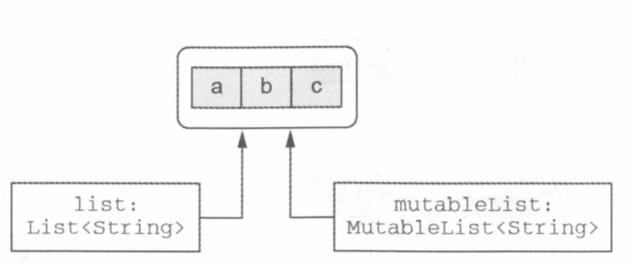

# CH6: 코틀린 타입 시스템

## 널 가능성

### 널이 될 수 있는 타입

코틀린은 널이 될 수 있는 타입을 명시적으로 지원한다. 코틀린에는 기본적으로 null을 객체에 대입할 수 없다. 만약 널을 대입하고 싶으면 타입 이름 뒤에 물음표를 명시해야 한다.

```kotlin
fun strLenSafe(s: String?) = ...
```

널이 될 수 있는 타입의 변수가 있다면 수행할 수 있는 연산이 제한된다. 예를 들어

```kotlin
fun strLenSafe(s: String?) = s.length()
```

변수.메소드() 처럼 메소드를 직접 호출할 수 없다.

또한 널이 될 수 있는 값을 널이 될 수 없는 타입의 변수에 대입할 수 없다.

```kotlin
val x: String? = null
var y: String = x // can't
strlen(x) // can't
```

컴파일러는 이런 타입을 null과 비교를 마치면 널이 아닌 타입처럼 사용하게 해준다.

```kotlin
fun strLenSafe(s: String?): Int =
	if (s != null) s.length else 0
```

### ?.

?. 연산자는 null 검사와 메소드 호출을 한 번의 연산으로 수행한다. 예를 들어 s?.toUpperCase()는 훨씬 복잡한 if (s ≠ null) s.toUpperCase() else null과 같다.

안전한 호출의 결과 타입도 널이 될 수 있느느 타입이다. String.toUpperCase는 String 타입의 값을 반환하지만 s가 널이 될 수 있으면 s?.toUpperCase() 식의 리턴 타입도 String?이다.

```kotlin
fun printAllCaps(s: String?) {
    val allCaps: String? = s?.toUpperCase()
    println(allCaps)
}
```

프로퍼티를 읽거나 쓸 때도 안전한 호출이 사용 가능하다.

```kotlin
class Employee(val name: String, val manager: Employee?)
fun managerName(employee: Employee): String? = employee.manager?.name
```

?. 연산자는 체이닝이 가능하다.

```kotlin
class Address(val streetAddress: String, val zipCode: Int, val city: String, val country: String)
class Company(val name: String, val address: Address?)
class Person(val name: String, val company: Company?)

fun Person.countryName(): String {
    val country = this.company?.address?.country
    return if (country != null) country else "Unknown"
}
```

### ?: 엘비스 연산자

코틀린은 null 대신 사용할 디폴트 값을 지정할 때 편리하게 사용할 수 있는 연산자를 제공한다.

```kotlin
fun foo(s: String?) {
	val t: String = s ?: ""
}
```

이 연산자는 객체가 널인 경우 널을 반환하는 안전한 호출 연산자와 함께 사용해서 객체가 널인 경우에 대비한 값을 지정하는 경우도 많다.

```kotlin
fun strLenSafe(s: String?): Int = s?.length ?: 0
```

코틀린은 return이나 throw 등의 연산도 식이다. 따라서 엘비스 오른쪽에 return, throw 연산을 넣을 수 있다.

```kotlin
fun printShippingLabel(person: Person) {
    val address = person.company?.address
        ?: throw IllegalArgumentException("No Address")
    with(address) {
        println(streetAddress)
        println("$zipCode $city $country")
    }
}
```

### 안전한 캐스트 : as?

as로 지정한 타입으로 바꿀 수 없으면 ClassCastException이 발생한다. 물론 is를 통해 검사가 가능하지만 as?를 사용한 더 좋은 해법이 있다.

as? 는 값을 대상 타입으로 변환할 수 없으면 null을 리턴한다.


```kotlin
class Person(val firstName: String, val lastName: String) {
    override fun equals(other: Any?): Boolean {
        val otherPerson = other as? Person ?: return false
        return otherPerson.firstName == firstName &&
                otherPerson.lastName == lastName
    }
}
```

### 널 아님 단언 : !!

null not assertion은 코틀린에서 널이 될 수 있는 타입의 값을 다룰 때 사용할 수 있는 도구 중 가장 단순하면서 무딘 도구이다.

!!을 사용하면 어떤 값이든 널이 될 수 없는 타입으로 바꿀 수 있다. 실제로 !!를 null에 적용하면 NPE가 발생한다.

```kotlin
fun ignoreNulls(s: String?) {
    val sNotNull: String = s!!
    println(sNotNull.length)
}
```

!!을 널에 대해 사용해서 발생하는 예외의 스택 트레이스에는 어떤 파일의 몇 번째 줄인지에 대한 정보는 들어있지만 어떤 식에서 예외가 발생했는지에 대한 정보가 들어 있지 않다.

### let

let 함수를 안전한 호출 연산자와 함께 사용하면 원하는 식을 평가해서 결과가 널인지 검사한 다음에 그 결과를 변수에 넣는 작업을 간단한 식을 사용해 한꺼번에 처리할 수 있다.

```kotlin
fun sendEmailTo(email: String) {

}

fun main(args: Array<String>) {
    val email: String? = ""
    sendEmailTo(email) // cant
}
```

이런 경우에 let 함수를 인자를 전달할 수 있다. let 함수는 자신의 수신 객체 인자로 전달받은 람다에게 넘긴다. 널이 될 수 있는 값에 대해 안전한 호출 구문을 사용해 let을 호출하되 널이 될 수 없는 타입을 인자로 받는 람다를 let에 전달한다.


```kotlin
fun sendEmailTo(email: String) {
    println("Sending email to $email")
}

fun main(args: Array<String>) {
    val email: String? = "yole@example.com"
    email?.let { sendEmailTo(it) }
}
```

아주 긴 식이 있고 그 값이 널이 안리 때 수행해야 하는 로직이 있을 때 let을 쓰면 편하다. let을 쓰면 긴 식의 결과를 저장하는 변수를 따로 만들 필요가 없다.

```kotlin
val person: Person? = getTheBestPerson()
if (person != null) sendEmailTo(person.email)

getTheBestPerson()?.let { sendEmailTo(it.email)
```

### 나중에 초기화할 프로퍼티

코틀린에서 클래스 안의 널이 될 수 없는 프로퍼티를 생성자 안에서 초기화하지 않고 특별한 메소드 안에서 초기화할 수는 없다. 이런 초기화 값을 제공하려면 널이 될 수 있는 타입을 사요할 수 밖에 없다. 하지만 이런경우 모든 프로퍼티 접근에 널 검사나 !! 연산자를 써야 한다.

```kotlin
class MyService {
    fun performAction(): String = "foo"
}
class MyTest {
    private var myService: MyService? =null
    @Before fun setUp() {
        myService = MyService()
    }
    @Test fun testAction() {
        Assert.assertEqauls("foo", myService!!.performAction())
    }
}
```

이를 해결하기 위해 나중해 초기화가 가능하다.

```kotlin
class MyService {
    fun performAction(): String = "foo"
}
class MyTest {
    private lateinit var myService: MyService

    @Before fun setUp() {
        myService = MyService()
    }
    @Test fun testAction() {
        Assert.assertEqauls("foo", myService.performAction())
    }
}
```

lateinit 프로퍼티는 항상 var이여한다. val 프로퍼티는 final 필드로 컴파일되어, 생성자 안에서 반드시 초기화해야 한다.

### 널이 될 수 있는 타입 확장

어떤 메소드를 호출하기 전에 수신 객체 역할을 하는 변수가 널이 될 수 없다고 보장하는 대신, 직접 변수에 대해 메소드를 호출해도 확장 함수인 메소드가 알아서 널을 처리해준다. 이런 처리는 확장 함수에서만 가능하다. 일반 멤버 호출은 객체 인스턴스를 통해 디스패치 됨으로 그 인스턴스가 널인지 여부를 검사하지 않는다.

```kotlin
fun verifyUserInput(input: String?) {
    if(input.isNullOrBlank()) println("Plz fill in the rquired fields")
}

fun main(args: Array<String>) {
    verifyUserInput(" ")
    verifyUserInput(null)
}
```

안전한 호출 없이도 널이 될 수 있는 수신 객체 타입에 대해 선언된 확장 함수를 호출 가능하다. 함수는 null 값이 들어오는 경우 이를 처리한다.


이 함수를 좀 더 살펴보면 이런식으로 구현이 되어있다.

```kotlin
fun String?.isNullOrBlank(): Boolean =
    this == null || this.isBlank()
```

?타입에 대한 확장을 정의하면 널이 될 수 있는 값에 대해 그 확장 함수를 호출할 수 있다. 이런 함수의 내부에서 this가 null이 될 수 있기 때문에 널 여부를 검사해야 한다. 자바에서는 메소드 안의 this는 그 메소드가 호출된 수식 객체를 가리키므로 항상 널이 아니다.

let 함수도 널이 될 수 있는 타입의 값에 대해 호출할 수 있지만 let은 this가 널인지 검사하지 않는다. 널이 될 수 있는 타입의 값에 대해 안전한 호출을 사용하지 않고 let을 호출하면 람다의 인자는 널이 될 수 있는 타입으로 추론된다.

```kotlin
val person: Person? = ...
person.let { sendEmailto(it) } //ERR : 여기서 it은 ?타입
person?.let { sendEmailto(it) }
```

### 타입 파라미터의 널 가능성

함수나 클래스의 모든 타입 파라미터는 기본적으로 널이 될 수 있다. 널이 될 수 있는 타입을 포함하는 어떤 타입이라도 타입 파라미터를 대신할 수 있다. 따라서 타입 파라미터 T를 클래스나 함수 안에서 타입 이름으로 사용하면 이름 끝에 물음표가 없더라도 T는 ?타입인것이다.

```kotlin
fun <T> printHashCode(t: T) {
    println(t?.hashCode())
}

fun main(args: Array<String>) {
    printHashCode(null) // Any
}
```

printHashCode T에 대한 추론한 타입은 널이 될 수 있는 Any? 타입이다. 타입 파라미터가 널이 아니여고 싶으면 upper bound를 지정해야한다.

```kotlin
fun <T: Any> printHashCode(t: T) {
    println(t?.hashCode())
}

fun main(args: Array<String>) {
    printHashCode(null)  // can't compile
}
```

### 플랫폼 타입

자바 코드에도 애노테이션으로 표시된 널 가능성 정보가 있다. 이런 정보가 있으면 코틀린도 활용한다. 만약에 이런 애노테이션이 없다면 플랫폼 타입이 된다.

플랫폼 타입은 코틀린이 널 관련 정보를 알 수 없는 타입을 말한다. 이를 널이 될 수 있는 타입으로 처리해도 되고 널이 될 수 없는 타입으로 처리해도 된다.

```kotlin
public class Person {
	private final String name;
	public Person(String name) {
		this.name = name;
	}
	public String getName() {
		return name;
	}
}
```

getName은 null을 리턴할까? 컴파일러가 전혀 알지 못하기 때문에 개발자가 알아서 처리해야 한다.

```kotlin
fun yellAt(person: Person) {
    println(person.name.toUpperCase() + "!!!")
}
fun main(args: Array<String>) {
   yellAt(Person(null))
}
```

여기서는 NPE가 아니라 toUperCase가 수신 객체로 널을 받을 수 없다는 더 자세한 예외가 발생한다. 컴파일러는 public인 코트린 함수의 널이 아닌 타입인 파라미터와 수신 객체에 대한 널 검사를 해준다. 따라서 public 함수에 널 값을 사용하면 즉시 예외가 발생한다. 이런 파라미터 값 검사는 함수 내부에서 파라미터를 사용하는 시점이 아니라 함수 호출 시점에 이루어진다.

프랫폼 타입을 ?타입이나 널이 될 수 없는 타입에 사용할 수 있다.

```kotlin
val s: String? = person.name
val s1: String = person.name
```

코틀린에서 자바 메소드를 오버라이드 할 때 그 메소드의 파라미터와 반환 타입을 널이 될 수 있는 타입으로 선언할지 널이 될 수 없는 타입으로 선언할지 결정해야 한다.

```kotlin
// JAVA
interface StringProcessor {
	void process(String value);
}
```

코틀린은 아래와 같이 두 구 현은 다 받아들인다.

```kotlin
class StringPrinter: StringProcessor {
    override fun process(value: String?) {
        println(value)
    }
}
class NullableStringPrinter: StringProcessor {
    override fun process(value: String?) {
        if (value != null) println(value)
    }
}
```

자바 클래스, 인터페이스를 코트린에서 구현할 경우 널 가능성을 제대로 처리하는 일이 중요하다.

## 원시 타입

### 원시타입

코틀린에서는 참조 타입밖에 없지만 원시 타입에 대해서 항상 객체로 표현하지는 않다. 실행 시점에 숫자 탕비은 가능한 가장 효율적인 방식으로 표현된다. 대부분의 경우 코틀린의 Int 타입은 자바 int 타입으로 컴파일 된다.

### 원시 ? 타입

null 참조를 자바의 참조 타입의 변수에만 대입할 수 있기 때문에 널이 될 수 있는 코틀린 타입은 자바 원시 타입으로 표현이 불가능하다.

### Any, Any?

코틀린에서는 Any 타입이 모든 널이 될 수 없는 타입의 조상 타입이다. Any 타입은 java.lang.Object로 대응한다.

### Unit 타입 : 코틀린의 void

코트린 Unit 타입은 자바 void 와 같은 기능을 한다. 다른 점은, Unit은 모든 기능을 갖는 일반적인 타입이며, void와 달리 Unit을 타입 인자로 쓸 수 있다. Unit 타입에 속한 값은 단 하나뿐이며, 그 이름도 Unit이다. Unit 타입 함수는 Unit 값을 묵시적으로 반환한다.

```kotlin
interface Processor<T> {
    fun process(): T
}
class NoResultProcessor: Processor<Unit> {
    override fun process() {

    }
}
```

### Nothing 타입

반환 값이라는 개념 자체가 의미 없는 함수가 일부 존재한다. 예를 들어 테스트 라이브러리는 Fail이라는 함수를 제공하는 경우가 많다. 이런 함수를 호출하는 코드를 분석하는 경우 함수가 정상적으로 끝나지 않는데 이를 표현하기 위해 Nothing이라는 특별한 반환 타입을 사용한다.

```kotlin
fun fail(message: String): Nothing{
    throw IllegalStateException(message)
}
```

Nothing은 아무 값도 포함하지 않는다. 따라서 함수의 반환 타입이나 반환 타입으로 쓰일 타입 파라미터로만 쓸 수 있다. Nothing을 반환하는 함수를 엘비스 연산자의 우항에 사용할 수 있다.

```kotlin
val address = company.address ?: fail("?No")
```

컴파일러는 Nothing이 반환 타입인 함수가 결코 정상 종료되지 않음을 알고 그 함수를 호출하는 코드를 분석할 때 사용한다.

## 컬렉션과 배열

### 읽기 전용과 변경 가능한 컬렉션

코틀린 에서는 컬렉션 안의 데이터에 접근하는 인터페이스와 컬렉션 안의 데이터를 변경하는 인턴페이스를 분리했다는 점이다. 가장 기초적인 인터페이스는 kotlin.collections.Collection부터 시작한다. 이 인터페이스를 사용하면 컬렉션 안의 원소를 이터레이션, 크기 얻기 등 연산을 할 수 있다. 하지만 Collection에는 원소를 추가하거나 제거하는 메소드가 없다.

컬렉션의 데이터를 수정하려면 kotlin.collections.MutableCollection 인터페이스를 사용해라.


또 염두에 둬야 할 점은 읽기 전용 컬렉션이라고 꼭 변경 불가능한 컬렉션일 필요가 없는 점우다. 읽기 전용 인터페이스 타입인 변수를 사용할 대, 그 인터페이스는 실제로 어떤 컬렉션 인스턴스를 가리키느느 수많은 참조 일 수 있다.



그래서 읽기 전용 컬렉션이 항상 스레드 안전하지 않다는 점을 명심해야 한다.

### 코틀린 컬렉션과 자바

모든 코틀린 컬렉션은 그에 상응하는 자바 컬렉션 인터페이스의 인스턴스라는 점은 사실이다.


자바 메소드를 호출하되 컬렉션을 인자로 넘겨야 한다면 따로 변환하거나 복사하는 등의 추가 작업 없이 직접 컬렉션을 넘면 된다. 자바는 따로 구분 짓지 않음으로 올바른 파라미터 타입을 사용할 책임은 프로그래머한테도 있다. 또한 ?타입으로 이루어진 컬렉션에서도 발생한다.

### 컬렉션을 플랫폼 타입으로 다루기

컬렉션 타입이 시그니처에 들어간 자바 메소드 구현을 오버라이드하려는 경우 읽기 전용 컬렉션과 변경 가능 컬렉션의 차이가 문제가 된다.

이런 내용을 고려해야 한다.

- 컬렉션이 널이 될 수 있는가?
- 컬렉션의 원소가 널이 될 수 있는가?
- 오버라이드하는 메소드가 컬렉션을 변경할 수 있는가?

```java
// JAVA
interface FilecontentProcessor {
	void processContents(File Path, byte[] binaryContents, List<String> textContents);
}
```

이 인터페이스를 구현하려면

- 일부 파일은 이진 파일이며, 리스트는 널이 될 수 있다.
- 파일의 각 줄은 널일 수 없다.
- 읽기 전용이다.

```java
class FileIndexer: FileContentProcessor {
    override fun processContents(path: File, binaryContents: ByteArray?, textContents: List<String>?)
}
```

### 객체의 배열과 원시 타입의 배열

```java
fun main(args: Array<String>) {
    for (i in args.indices) println(args[i])
}
```

코틀린 배열은 타입 파라미터를 받는 클래스다. 배열의 원소 타입은 바로 그 타입 파라미터에 의해 정해진다.

코틀린에서 배열을 만들려면

- arrayOf 함수
- arrayOfNulls
- Array : 배열 크기와 람다를 인자로 받아서 람다를 호출해서 각 배열 원소를 초기화해준다.

코틀린은 원시 타입의 배열을 표현하는 별도 클래스를 각 원시 타입마다 하나씩 제공한다. 예를 들어 Int 타입의 배열은 IntArray이다. 이는 int[]로 컴파일 된다. 이를 만드려면

- 각 배열 타입 생성자로, size 인자를 넘겨주면 디폴트 값으로 리턴한다.
- 팩토리 함수를 통해 여러 값을 가변 인자로 넘긴다
- 크기 + 람다
